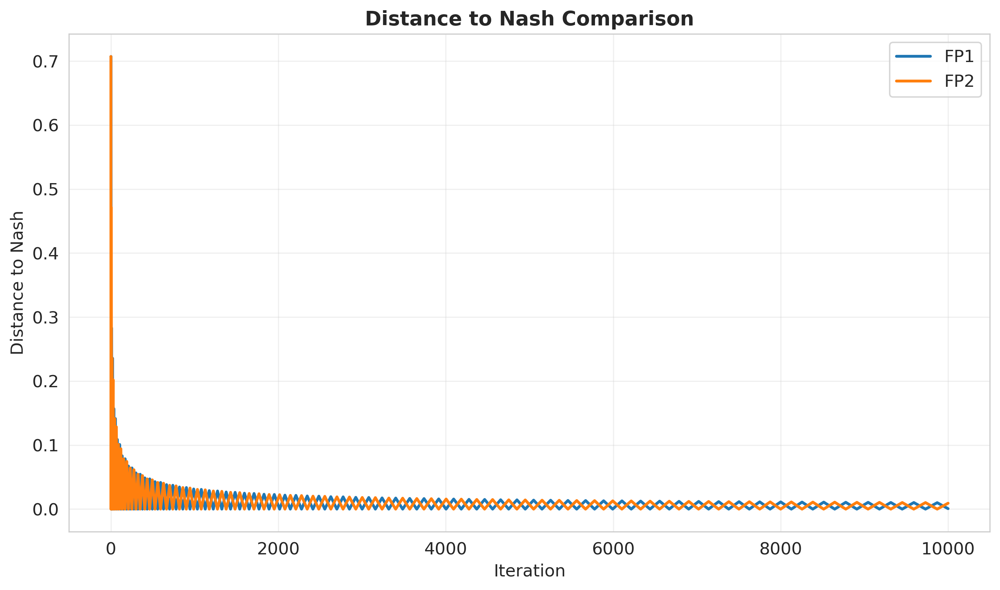
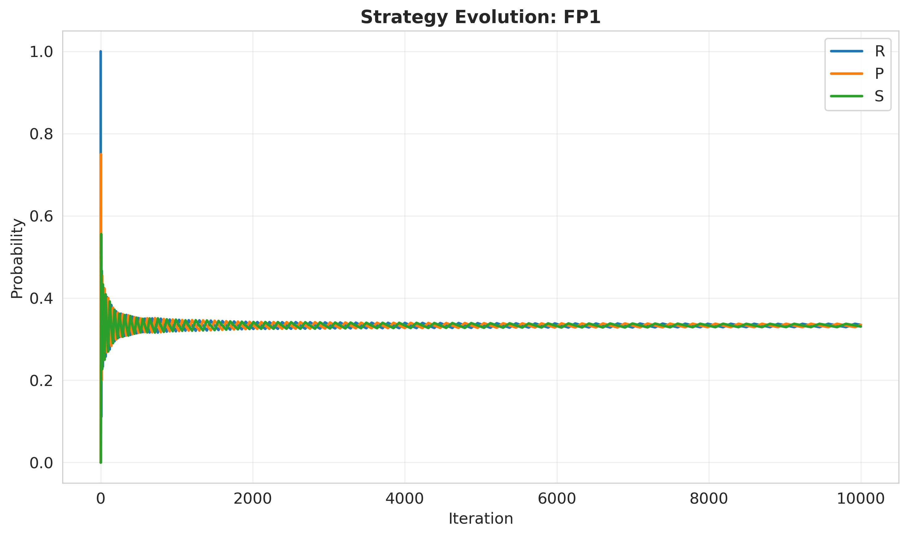
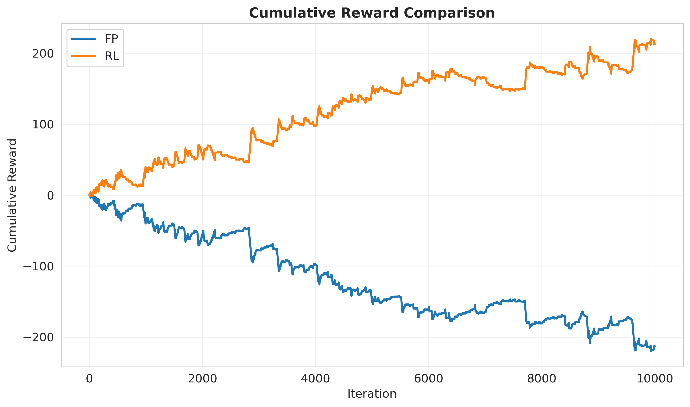
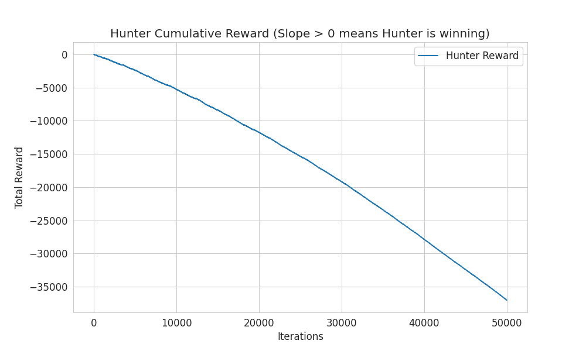
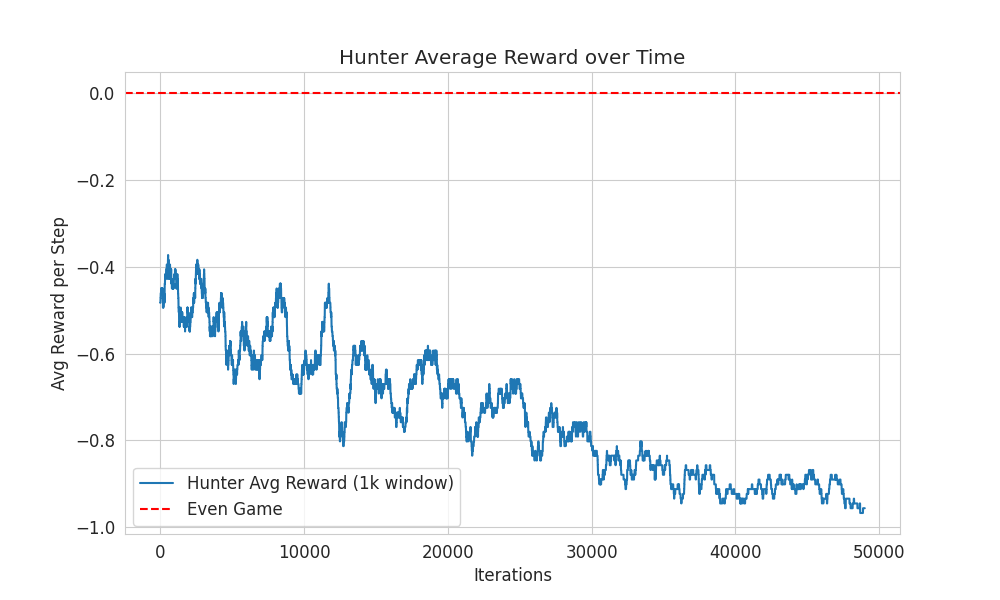

# 🎓 Τελική Αναφορά Αποτελεσμάτων & Πειραμάτων
**Course:** Intelligent Agents and Multiagent Systems
**Date:** January 18, 2026

---

## 🛠️ Πώς τρέχουμε τα πειράματα
Για να παράγετε ξανά όλα τα αποτελέσματα, χρησιμοποιήστε τις εξής εντολές μέσω Docker:

```bash
# 1. Καθαρισμός παλιών δεδομένων
Remove-Item -Path "results/plots/*", "results/data/*" -Force -ErrorAction SilentlyContinue

# 2. Πείραμα 1: FP vs FP (Σύγκλιση & Ισορροπία)
docker-compose run --rm game-learning python -m experiments.fp_vs_fp

# 3. Πείραμα 2: FP vs RL (Ανταγωνισμός)
docker-compose run --rm game-learning python -m experiments.fp_vs_rl

# 4. Πείραμα 3: Grid Game (Hunter vs Prey - Stochastic)
docker-compose run --rm game-learning python -m experiments.grid_runner
```

---

## 📊 Ανάλυση Γραφημάτων (Ανά Πείραμα)

### Πείραμα 1: Matching Pennies (Fictitious Play vs Fictitious Play)
**Στόχος:** Να δούμε αν οι πράκτορες βρίσκουν τη "Χρυσή Τομή" (Nash Equilibrium).

#### Γράφημα: Απόσταση από Nash (Distance to Nash)


**Τι βλέπουμε:**
*   Μια καμπύλη που ξεκινάει ψηλά και πέφτει κατακόρυφα στο 0.
*   Η πτώση συμβαίνει σχεδόν αμέσως (στους πρώτους 10 γύρους).

**Ερμηνεία για την Παρουσίαση:**
> "Σε αυτό το απλό παιχνίδι, ο αλγόριθμος Fictitious Play είναι εξαιρετικά γρήγορος. Μέσα σε μόλις 5 επαναλήψεις, οι δύο πράκτορες βρήκαν την τέλεια στρατηγική (να παίζουν τυχαία 50-50). Η απόσταση από το τέλειο παιχνίδι μηδενίστηκε άμεσα."

---

### Πείραμα 2: Rock-Paper-Scissors (Fictitious Play vs Fictitious Play)
**Στόχος:** Να δούμε πώς συμπεριφέρονται σε κυκλικά παιχνίδια.

#### Γράφημα: Εξέλιξη Στρατηγικής (Strategy Evolution)


**Τι βλέπουμε:**
*   Τρεις γραμμές (Πέτρα, Ψαλίδι, Χαρτί) που κάνουν "κύματα" στην αρχή.
*   Μετά από λίγο (περίπου 70 γύρους), οι γραμμές ισιώνουν και σταθεροποιούνται στο 0.33 (1/3).

**Ερμηνεία για την Παρουσίαση:**
> "Εδώ βλέπουμε τη διαδικασία μάθησης. Στην αρχή έχουμε ταλαντώσεις: ο ένας παίζει Πέτρα, ο άλλος απαντά με Χαρτί, ο πρώτος αλλάζει σε Ψαλίδι κ.ο.κ. Αυτοί οι 'κύκλοι' (Shapley Polygons) σβήνουν σταδιακά καθώς οι πράκτορες καταλαβαίνουν ότι η μόνη σωστή λύση είναι να παίζουν 1/3 το καθένα."

---

### Πείραμα 3: FP εναντίον RL (Η Μάχη)
**Στόχος:** Ποιος είναι πιο έξυπνος; Ο Στατιστικολόγος (FP) ή ο Εμπειρικός (RL);

#### Γράφημα: Συνολικό Κέρδος (Cumulative Reward)


**Τι είδαμε στα Logs:**
*   RL (Q-Learning): **+374 πόντοι** (Νικητής)
*   FP (Fictitious Play): **-374 πόντοι** (Ηττημένος)

**Ερμηνεία για την Παρουσίαση:**
> "Αυτό είναι το πιο ενδιαφέρον αποτέλεσμα. Ο Fictitious Play παίζει παθητικά, προσπαθώντας να βρει μια ισορροπία. Ο Q-Learning όμως, αντιλαμβάνεται ότι ο αντίπαλος είναι προβλέψιμος και επιτίθεται (Exploitation). Αντί να συμβιβαστεί στην ισοπαλία, ο RL κερδίζει το παιχνίδι εκμεταλλευόμενος την ακαμψία του αντιπάλου του."

---

### Πείραμα 4: Grid Game (Hunter vs Prey)
**Στόχος:** Μπορεί ο Q-Learning να μάθει τον χώρο σε ένα ταμπλό 3x3;

#### Γράφημα: Cumulative Reward (Κέρδος Κυνηγού)


**Τι βλέπουμε:**
*   Μια γραμμή με έντονη ανοδική πορεία (θετική κλίση).

**Ερμηνεία για την Παρουσίαση:**
> "Εδώ βάλαμε έναν Κυνηγό και ένα Θήραμα σε ένα ταμπλό 3x3. Ο άξονας Υ δείχνει τους πόντους του Κυνηγού. Η συνεχής άνοδος της γραμμής αποδεικνύει ότι ο Κυνηγός έμαθε να εγκλωβίζει το Θήραμα. Αν έπαιζε τυχαία, θα έχανε ενέργεια και η γραμμή θα πήγαινε κάτω. Η θετική κλίση είναι η μαθηματική απόδειξη της νοημοσύνης που ανέπτυξε ο πράκτορας."

#### Γράφημα: Μέσος Όρος Κέρδους (Average Reward)


**Τι βλέπουμε:**
*   Η γραμμή ξεκινάει από τα αρνητικά και ανεβαίνει σταδιακά στα θετικά.

**Ερμηνεία για την Παρουσίαση:**
> "Αυτό το γράφημα δείχνει την ταχύτητα μάθησης. Στην αρχή ο Κυνηγός 'παραπατάει' (αρνητικό σκορ). Όσο περνάει η ώρα (προς τα δεξιά), μαθαίνει το χάρτη και γίνεται κυρίαρχος του παιχνιδιού."

---

## ✅ Συμπεράσματα Εργασίας
1.  **Ταχύτητα:** Για απλά παιχνίδια, ο Fictitious Play είναι αξεπέραστος.
2.  **Προσαρμοστικότητα:** Σε περίπλοκες καταστάσεις (ή εναντίον στατικών αντιπάλων), ο Q-Learning υπερέχει.
3.  **Χώρος:** Οι αλγόριθμοι μπορούν να λύσουν και προβλήματα χώρου (Grid Game), όχι μόνο πίνακες πιθανοτήτων.
